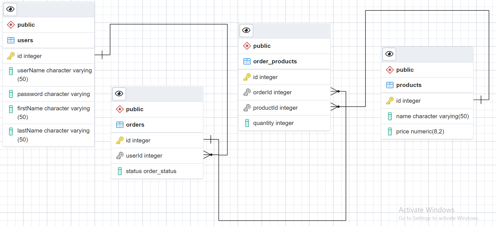

## database diagram

## database schema
```sh
              List of relations
 Schema |      Name      | Type  |   Owner
--------+----------------+-------+------------
 public | migrations     | table | storefront
 public | order_products | table | storefront
 public | orders         | table | storefront
 public | products       | table | storefront
 public | users          | table | storefront

```
## users Table 
```sh
  Column   |         Type          | Collation | Nullable |              Default
-----------+-----------------------+-----------+----------+-----------------------------------
 id        | integer               |           | not null | nextval('users_id_seq'::regclass)
 userName  | character varying(50) |           | not null |
 password  | character varying     |           | not null |
 firstName | character varying(50) |           | not null |
 lastName  | character varying(50) |           |          |
Indexes:
    "users_pkey" PRIMARY KEY, btree (id)
    "users_userName_key" UNIQUE CONSTRAINT, btree ("userName")
Referenced by:
    TABLE "orders" CONSTRAINT "fk_users" FOREIGN KEY ("userId") REFERENCES users(id)

```

## products Table 
```sh
 Column |         Type          | Collation | Nullable |               Default
--------+-----------------------+-----------+----------+--------------------------------------
 id     | integer               |           | not null | nextval('products_id_seq'::regclass)
 name   | character varying(50) |           | not null |
 price  | numeric(8,2)          |           | not null |
Indexes:
    "products_pkey" PRIMARY KEY, btree (id)
Referenced by:
    TABLE "order_products" CONSTRAINT "fk_products" FOREIGN KEY ("productId") REFERENCES products(id)

```

## orders Table 
```sh
 Column |     Type     | Collation | Nullable |              Default
--------+--------------+-----------+----------+------------------------------------
 id     | integer      |           | not null | nextval('orders_id_seq'::regclass)
 userId | integer      |           | not null |
 status | order_status |           | not null |
Indexes:
    "orders_pkey" PRIMARY KEY, btree (id)
Foreign-key constraints:
    "fk_users" FOREIGN KEY ("userId") REFERENCES users(id)
Referenced by:
    TABLE "order_products" CONSTRAINT "fk_orders" FOREIGN KEY ("orderId") REFERENCES orders(id) ON DELETE CASCADE

```

## order_products Table 
```sh
  Column   |  Type   | Collation | Nullable |                  Default
-----------+---------+-----------+----------+--------------------------------------------
 id        | integer |           | not null | nextval('order_products_id_seq'::regclass)
 orderId   | integer |           | not null |
 productId | integer |           | not null |
 quantity  | integer |           | not null |
Indexes:
    "order_products_pkey" PRIMARY KEY, btree (id)
Foreign-key constraints:
    "fk_orders" FOREIGN KEY ("orderId") REFERENCES orders(id) ON DELETE CASCADE
    "fk_products" FOREIGN KEY ("productId") REFERENCES products(id)

```
